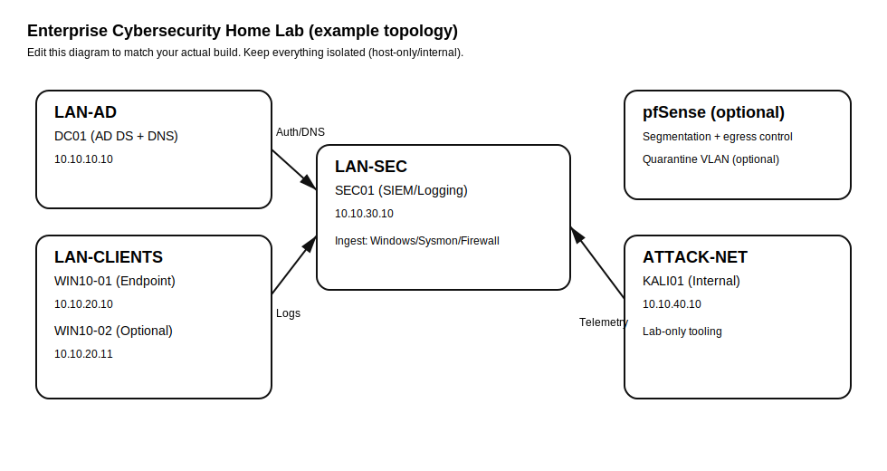

# Enterprise Cybersecurity Home Lab (Purple Team) 🛡️⚔️

> A recruiter-friendly, reproducible **enterprise-style** virtual lab that simulates a small corporate network
(Active Directory + endpoints + attacker box + centralized logging) to practice **attack techniques, detections, and incident response** safely.

**What you'll find in this repo**
- ✅ Clear **lab architecture** + network segmentation notes
- ✅ Centralized telemetry + **detection engineering** examples
- ✅ Incident response **runbooks** (triage playbooks)
- ✅ Documented purple-team **scenarios** with evidence checklist
- ✅ Repo hygiene: CI, templates, contributing docs, and safe-use policy

> **Safety first:** everything here is meant for **isolated lab environments you own/control**. No public scanning.

---

## Lab topology

**Suggested components**
- **Attacker VM:** Kali Linux (internal-only)
- **Identity:** Windows Server (AD DS + DNS)
- **Endpoints:** Windows 10/11 client(s)
- **Logging/Detection:** Wazuh / Elastic / Splunk (choose one)
- **Firewall/Router (optional):** pfSense for segmentation and egress control

---

## Skills demonstrated (what recruiters care about)
- Network design: segmentation, routing, DNS troubleshooting, service reachability
- Windows enterprise fundamentals: AD DS, domain join, GPO baselines, event logs
- Telemetry: Sysmon + Windows Security logs + agent forwarding
- Detection engineering: mapping behaviors to **MITRE ATT&CK**, tuning, false-positive handling
- Incident response: triage → scope → contain → eradicate → recover (documented)

---

## Quick start

### Prerequisites
- Host: **16GB RAM+** recommended (32GB ideal), CPU virtualization enabled
- Disk: **120GB+ free**
- Virtualization: VirtualBox or VMware Workstation/Player

### Build order (high level)
1. Create virtual networks (see `infra/**/network-notes.md`)
2. Build Domain Controller and promote to domain (`docs/architecture.md`)
3. Join endpoint(s) to domain
4. Install telemetry agents + Sysmon
5. Confirm ingestion with `scripts/checks/validate-lab.*`
6. Work through `/scenarios`

---

## Scenarios (attack → detect → respond)

These are **lab-only** exercises. Each scenario includes:
- objective and prerequisites
- safe execution steps (high level)
- expected artifacts (logs) + detection ideas
- response actions + hardening
- evidence checklist for screenshots

1. `scenarios/01-enumeration-nmap.md`
2. `scenarios/02-auth-failures-and-spray-simulation.md`
3. `scenarios/03-lateral-movement-simulation.md`
4. `scenarios/04-detection-and-triage.md`
5. `scenarios/05-hardening-and-retest.md`

---

## Repo tour
- `docs/` — architecture, threat model, detections, runbooks, screenshots
- `infra/` — hypervisor/pfSense notes and VM settings
- `configs/` — hardening and logging configuration references
- `scripts/` — bootstrap + validation helpers
- `.github/` — workflows, issue templates, PR template

---

## Evidence (make it “recruiter proof”)
Add 6–12 screenshots under `docs/screenshots/`:
- topology view (networks + VMs)
- AD Users/Computers and a joined endpoint
- SIEM/agent showing new host logs
- one detection firing + your triage notes
- hardening change (GPO/baseline) + re-test

---

## Roadmap
- [ ] Optional pfSense segmentation + allow-list egress
- [ ] Add Zeek for network telemetry
- [ ] Add ATT&CK-mapped “atomic” validation tests
- [ ] Add automated provisioning (Vagrant/Ansible)

---

## License
MIT — see [LICENSE](LICENSE)

## Safe use
See [SECURITY.md](SECURITY.md)
